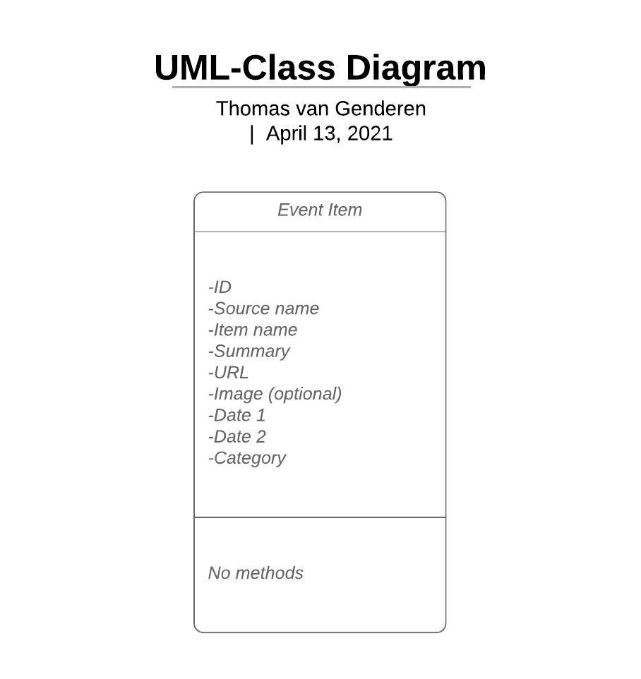
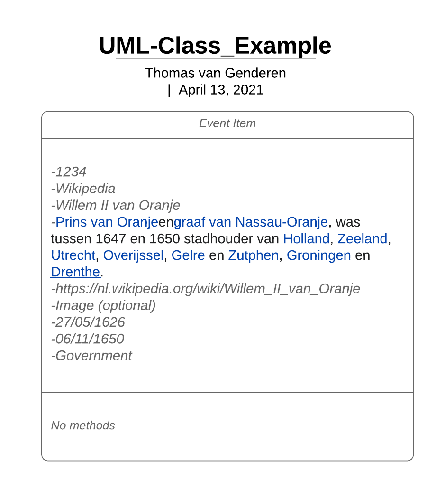

### Thomas van Genderen Spring 2021 

# Design Document

## Features

The projects main aim is to provide a platform for a easy, holistic and chronological display of historical events for its users. The aim is to provide a way to enter data into a database with a standardised format, then aorder that data in a chronological order, after which it is displayed to the user while taking the assigned type of the data in regard.

### Main features 
- Manual entry of items to be displayed
- Scraping data from Wikipedia (and other sites).
- Selecting filters for events.
- Building a timeline based on filters.
- Storing Wikipedia data in SQL database.
- Zoom feature on timeline scope.
- Selecting events on timeline brings up extensive information and link to article.
- Data storage using a SQL database. (MVP)
- Data exchange between SQL database and Google Spreadsheet file(s). (MVP)
- Spreadsheet data is displayed to user on a highly interactive timeline. (MVP)

## User interface

Still needs work

## Database
Design

Example

## Lists

Include a couple of lists that are more detailed than in your proposal document:

a list of APIs and frameworks or plugins that you will be using to provide functionality in your app (and explain exactly what features you’re using them for)

a list of data sources if you will get data from an external source, including information on how your are going to filter and transform the data for your project, with examples of raw data and the actual data you need

Scraped from Wikipedia will be an URL, picture, summary, dates, names, and possibly more with the use of __BeautifulSoup4__

The database will be created and interacted with with the use of __SQLAlchemy__

The tool for the JS interactive timeline will be __TimelineJS__

__pandas__ is probably needed for the data analysis.

__LXML__ as a parser.

__Google spreadsheet__ will be one of the main data repositories in a csv format.

