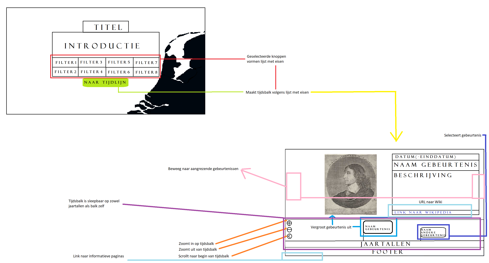
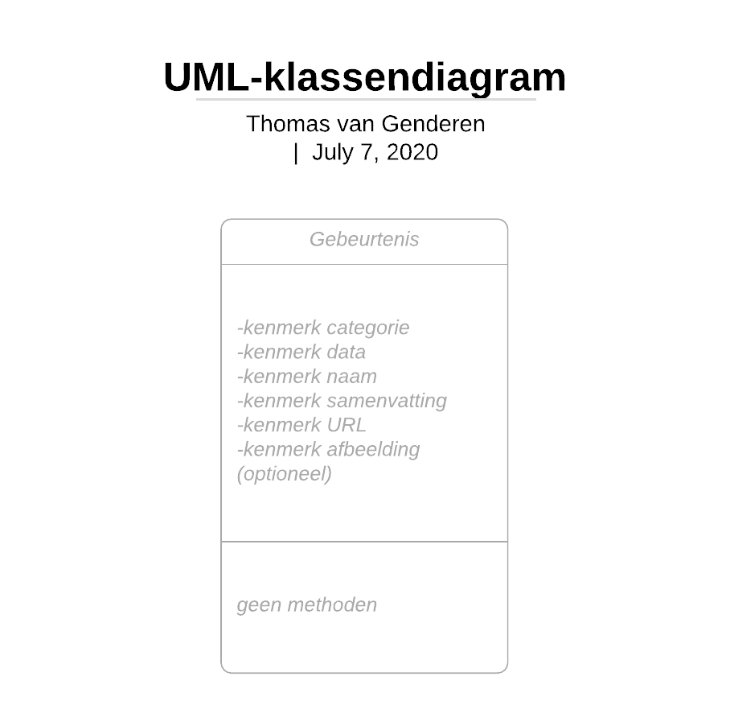

# Thomas van Genderen Spring 2021 

# Design Document

[
    Based on your proposal, you can now start studying your problem in a more technical fashion. Map the separate parts of the solution onto the framework(s) that you are using. What APIs, methods or techniques do you need to implement each feature?

Think about and fully express how the user interface will be handled, where the data is coming from, and how the various parts will work together to form a complete application.

The teaching staff and your fellow students can help you spot fundamental problems that need to be solved, or if technical limitations will likely prevent you from finishing the project.

!!! It is expected that you separate, in your code, handling of the user interface from data management and from complex algorithms whenever possible. It should be clear from your design document how you are going to do this!!!

# Features
First list the features that users will be able to use:

Include a brief list of main features that will be available to users. All features should also be visible in the sketch. If you have complicated features, it might be good to create a separate sketch for each feature. Yes, you will do a lot of sketching! This is required.

Mark which features define the minimum viable product (MVP) and which parts may be optional to implement. An MVP has a minimum amount of features, but is still a good product. This is the part that you have to agree on/negotiate with your teacher before starting to code!

# User interface
Draw a detailed walkthrough of the user interface of your app. You should draw multiple “screens” separately, in order to make very clear the things that happen on screen when navigating the app.

You must create “professional” drawings using a software tool. Some examples of what we expect:

Do make sure that you use realistic content in your sketches! Google a few images, write real texts and make sure it gives a good impression of what you want to make.

] 

# Don't forget to update README.md !!!

## Features

Include a brief list of main features that will be available to users. All features should also be visible in the sketch. If you have complicated features, it might be good to create a separate sketch for each feature. Yes, you will do a lot of sketching! This is required.

- Scraping data from Wikipedia.
- Selecting filters for events.
- Building a timeline based on filters.
- Storing Wikipedia data in SQL database.
- Zoom feature on timeline scope.
- Selecting events on timeline brings up extensive information and link to article.

Mark which features define the minimum viable product (MVP) and which parts may be optional to implement. An MVP has a minimum amount of features, but is still a good product. This is the part that you have to agree on/negotiate with your teacher before starting to code!

MVP:
I. Stores data in SQL database.
II. Transports database data to a google spreadsheets file
III. Displays spreadsheets data as interactive timeline.

