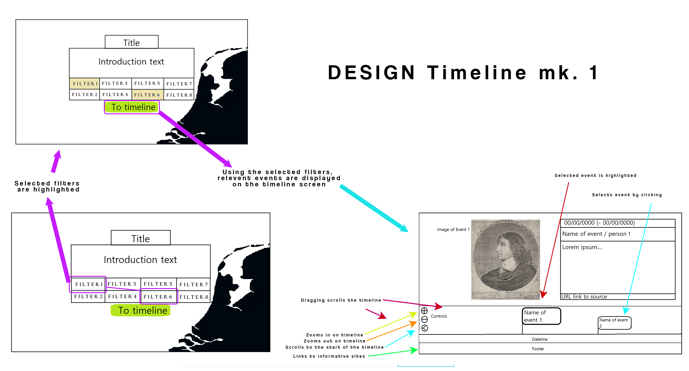

### Thomas van Genderen Spring 2021 

# Design Document

## Features

The projects main aim is to provide a platform for a easy, holistic and chronological display of historical events for its users. The aim is to provide a way to enter data into a database with a standardised format, then aorder that data in a chronological order, after which it is displayed to the user while taking the assigned type of the data in regard. These types are things like government, art, religion, royalty, science, warfare, etc.

Wikipedia is hard to scrap due to the lack of uniformity. Therefore the data will have to be entered manually. The admin will be able to enter items directly into the database. Users will have their first entries ratified by the admins and after a certain degree of reliability has been estabilished, they will be free to enter data directly. (Admins can still remove faulty data.)

Afterwards the Admin would still need the capacity to police individual users for quality control.

### Main features 
- Manual entry of items to be displayed
- Scraping data from Wikipedia (and other sites).
- Selecting filters for types on events. (government, art, religion, royalty, science, warfare, etc.)
- Building a timeline based on the above mentioned types.
- Zoom feature on timeline scope.
- Users need to pass validation before they can add items at will
- Selecting events on timeline brings up extensive information and link to article.
- Users are able to add data to the database (MVP)
- Data storage using a SQL database. (MVP)
- Data exchange between SQL database and Google Spreadsheet file(s). (MVP)
- Spreadsheet data is displayed to user on a highly interactive timeline. (MVP)
- Items on timeline contain a link to source and optionally some media content.

## User interface

## Database
Design for Database item

## Lists
### Required for this project will be:

Scraped from Wikipedia will be an URL, picture, summary, dates, names, and possibly more with the use of __BeautifulSoup4__

The tool for the JS interactive timeline will be __TimelineJS__. It is very interactive and easy to input data to.

__Google spreadsheet__ will be one of the main data repositories in a csv format. Google spreadsheets can store an online accesable .csv file which houses the data that __TimelineJS__ uses to construct a timeline. It is also a useful format as it is easy to edit.

