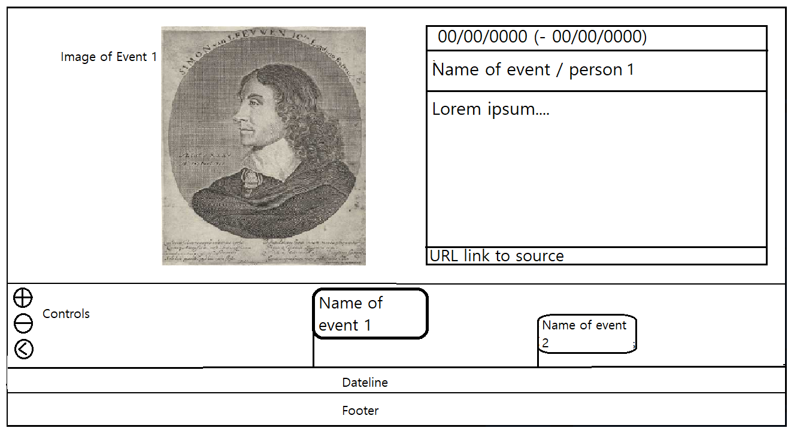

# Thomas van Genderen Spring 2021 

# The Past in Perspective / Het verleden in beeld

The idea of this site is to bring history into perspective. I envision the user selecting a year in time and seeing the technology, economy, government etc. of that year. 
The data will be scraped from Wikipedia and displayed on the site. the user will be able to select an object and navigate to its Wikipedia page.

## Problem statement

History is traditionally taught as a series of facts with dates, but context and contemporary events are often disregarded. I want to gather these loose facts on an intuitive timeline that gives a more holistic of overview of history. Sites like http://histography.io/ are rare and often too global (or too narrow like http://www.tiki-toki.com/timeline/entry/585659/Holocaust-in-Europa/ and https://www.kolonienvanweldadigheid.eu/tijdlijn/. They focus of specific periods of history). The target audience will be those interested in Dutch history with a need of context to complement general facts and figures.

The target audience will be those interested in Dutch history with a need of context to complement general facts and figures.

## Solution description

The application will be a site that displays which events took place in the same year. It will scrape Wikipedia for events relevant to Dutch history into a SQL database. Data will then be displayed on an interactive representation of a timeline.

## Details and sketches

Scraped from Wikipedia will be an URL, picture, summary, dates, names, and possibly more with the use of __BeautifulSoup4__

The database will be created and interacted with with the use of __SQLAlchemy__

The tool for the JS interactive timeline will be __TimelineJS__

__pandas__ is probably needed for the data analysis.

__LXML__ as a parser.

Challenges:  

A function will need to be coded to efficiently scrape relevant data in Dutch. Wikipedia is not consistent in its page-design.

The scraped data is not guaranteed to be consistent in composition. The database will need to be flexible and organised. This is something to figure out while designing it.

The mainpage will be fully interactable and will link to different Wikipedia pages. It needs to be created automaticaly based on the database. This will require a lot of JS integration. (A good example is https://www.kaapskil.nl/ontdek/400-jaar-skil/)

install requirements:
beautifulsoup4
lxml
requests
